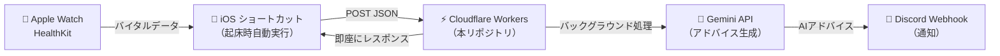

# HRV Analyzer

iPhoneのヘルスケアアプリ（Apple Watch）で取得した **睡眠中の心拍変動（HRV）**、**睡眠中の安静時心拍数（RHR）**、**睡眠時間**、**睡眠の質（深い睡眠の割合）** から、現在の体の疲労・回復状態を統計的に分析する Cloudflare Workers API です。

## 概要

Apple Watch が毎日記録するバイタルデータを、iOS ショートカットアプリ経由で本 API に送信すると、過去1ヶ月分のデータに基づく統計処理（中央値・平均値・標準偏差）を行い、**今日のコンディション評価**と**LLM 向けプロンプト**を返却します。

さらに、`/notify` エンドポイントを使用すると、サーバーサイドで Gemini API によるアドバイス生成と Discord Webhook への通知を非同期で自動実行できます。

### システム構成



## 技術スタック

| レイヤー | 技術 | 備考 |
|---------|------|------|
| データ取得 | iOS ショートカット + HealthKit | 起床時オートメーションで自動実行 |
| 統計計算 | Cloudflare Workers (TypeScript) | 月10万リクエスト無料、ゼロコールドスタート |
| AI テキスト生成 | Gemini API (`gemini-2.5-flash-preview-05-20`) | サーバーサイドで自動実行 |
| 通知 | Discord Webhook | バックグラウンドで非同期通知 |
| テスト | Vitest + @cloudflare/vitest-pool-workers | Workers ランタイム上でのテスト |

## API 仕様

### エンドポイント一覧

| エンドポイント | 認証 | 説明 |
|---------------|------|------|
| `POST /` | 不要 | データ分析のみ（JSON レスポンス） |
| `POST /notify` | 必要 | データ分析 + Gemini → Discord 非同期通知 |

※ POST 以外のメソッドは `405 Method Not Allowed` を返します。

---

### `POST /` — データ分析エンドポイント

```
POST /
Content-Type: application/json
```

#### リクエストボディ

iOSショートカットから、カンマ区切りのテキストデータを含むJSONが送信されます。

```json
{
  "hrv": {
    "hrv_dates": "<カンマ区切りの日時文字列>",
    "hrv_value": "<カンマ区切りの数値文字列>"
  },
  "sleep": {
    "sleep_start_dates": "<カンマ区切りの日時文字列>",
    "sleep_end_dates": "<カンマ区切りの日時文字列>",
    "sleep_value": "<カンマ区切りの数値文字列>"
  },
  "rhr": {
    "rhr_dates": "<カンマ区切りの日時文字列>",
    "rhr_value": "<カンマ区切りの数値文字列>"
  }
}
```

#### データ形式の詳細

各フィールドの値は、iOSショートカットで生成された**カンマ (`,`) 区切り**のテキストです。

```
hrv_dates の例:
"2026-05-05T00:12:35,2026-05-05T02:11:30,2026-05-05T04:11:37,..."

hrv_value の例:
"31.2,45.8,28.3,..."
```

#### 各フィールドの意味

| カテゴリ | フィールド | 内容 |
|---------|-----------|------|
| **HRV（心拍変動）** | `hrv_dates` | 計測日時（ISO 8601） |
| | `hrv_value` | HRV 値（ms） |
| **睡眠** | `sleep_start_dates` | 睡眠開始日時 |
| | `sleep_end_dates` | 睡眠終了日時 |
| | `sleep_value` | 睡眠ステージ（Core, Deep, REM, Asleep, InBed, Awake） |
| **RHR（安静時心拍数）** | `rhr_dates` | 計測日時 |
| | `rhr_value` | 安静時心拍数（bpm） |

#### レスポンス

統計処理の結果と、LLM に渡すためのプロンプトコンテキストを含む JSON を返します。

```json
{
  "metrics": {
    "hrv": { "baseline_median": 39.6, "baseline_stddev": 21.7, "today": 31.2 },
    "rhr": { "baseline_mean": 65.4, "today": 72.0 },
    "sleep": { "baseline_mean_hours": 7.2, "today_hours": 5.5, "today_deep_percentage": 18.5 }
  },
  "prompt_context": "【本日の体調データ】\n・心拍変動(HRV): 31.2 (平常時中央値39.6±21.7より低め)\n...・深い睡眠の割合: 18.5%"
}
```

---

### `POST /notify` — 非同期通知エンドポイント

```
POST /notify
Content-Type: application/json
Authorization: Bearer <API_SECRET_TOKEN>
```

iOSショートカットからヘルスケアデータを受け取り、**即座にレスポンスを返却**した後、バックグラウンドで以下の処理を実行します：

1. ヘルスケアデータの統計分析
2. Gemini API でパーソナライズされた体調アドバイスを生成
3. Discord Webhook でアドバイスを通知

#### リクエストボディ

`POST /` と同じ形式のJSONを送信します。

#### レスポンス（即座に返却）

```json
{
  "status": "accepted",
  "message": "データを受け取りました！バックグラウンドで処理中です。"
}
```

ステータスコード: `202 Accepted`

#### エラーレスポンス

| ステータスコード | 条件 |
|----------------|------|
| `401 Unauthorized` | 認証トークンが無い or 不正 |
| `400 Bad Request` | JSON パースエラー or 睡眠データなし |
| `503 Service Unavailable` | シークレットが未設定 |

---

### 共通エラーレスポンス

| ステータスコード | 条件 |
|----------------|------|
| `405 Method Not Allowed` | POST 以外のメソッド |
| `404 Not Found` | 存在しないパス |

## 統計処理アルゴリズム

送信された過去1ヶ月分のデータに対し、以下の統計処理を行います。

### ① HRV（心拍変動）— 自律神経とストレスの指標

| 統計量 | 目的 |
|--------|------|
| 過去1ヶ月の睡眠中 HRV の**中央値** | 平常時の基準値（平均値よりノイズに強い） |
| 過去1ヶ月の睡眠中 HRV の**標準偏差** | 個人ごとの「正常なゆらぎの幅」の算出 |
| 今日の睡眠中 HRV の**平均値** | 今日の自律神経の回復スコア |

### ② RHR（安静時心拍数）— 肉体的な疲労と負荷の指標

| 統計量 | 目的 |
|--------|------|
| 過去1ヶ月のRHR の**平均値** | 平常時の基準値 |
| 最新のRHR の**値** | 最新の肉体疲労スコア |

### ③ 睡眠時間と質 — 回復の土台となる指標

| 統計量 | 目的 |
|--------|------|
| 過去1ヶ月の**平均睡眠時間** | 普段の睡眠習慣のベースライン |
| 今日の**睡眠時間** | 今日の活動限界の予測 |
| 今日の**深い睡眠の割合** | 身体的な回復度の評価（15%未満でシステム警告を追加） |

## 開発

### 前提条件

- Node.js
- npm

### セットアップ

```bash
npm install
```

### 環境変数（シークレット）の設定

`/notify` エンドポイントを使用するには、以下のシークレットの設定が必要です。

#### ローカル開発

プロジェクトルートに `.dev.vars` ファイルを作成し、以下の内容を記載します：

```
GEMINI_API_KEY=your-gemini-api-key
DISCORD_WEBHOOK_URL=https://discord.com/api/webhooks/xxxxx/xxxxx
API_SECRET_TOKEN=your-secret-token
```

#### 本番環境（Cloudflare Workers）

```bash
npx wrangler secret put GEMINI_API_KEY
npx wrangler secret put DISCORD_WEBHOOK_URL
npx wrangler secret put API_SECRET_TOKEN
```

### ローカル開発

```bash
npm run dev
```

### テスト

```bash
npm test
```

### デプロイ

```bash
npm run deploy
```

### 型生成

`wrangler.jsonc` のバインディング変更後に実行してください。

```bash
npm run cf-typegen
```

## ライセンス

[MIT](LICENSE)
