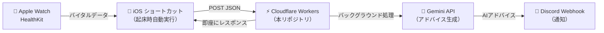

# HRV Analyzer

iPhoneのヘルスケアアプリ（Apple Watch）で取得した **睡眠中の心拍変動（HRV）**、**睡眠中の安静時心拍数（RHR）**、**呼吸数（Respiratory Rate）**、**睡眠時間**、**睡眠の質（深い睡眠の割合）** から、現在の体の疲労・回復状態を統計的に分析する Cloudflare Workers API です。

## 概要

Apple Watch が毎日記録するバイタルデータを、iOS ショートカットアプリ経由で本 API に送信すると、過去1ヶ月分のデータに基づく統計処理（中央値・平均値・標準偏差）を行い、**今日のコンディション評価のテキストデータ**を返却します。

さらに、`/notify` エンドポイントを使用すると、サーバーサイドで Gemini API によるアドバイス生成と Discord Webhook への通知を非同期で自動実行できます。

### システム構成



## 技術スタック

| レイヤー | 技術 | 備考 |
|---------|------|------|
| データ取得 | iOS ショートカット + HealthKit | 起床時オートメーションで自動実行 |
| 統計計算 | Cloudflare Workers (TypeScript) | 月10万リクエスト無料、ゼロコールドスタート |
| AI テキスト生成 | Gemini API (`gemini-2.5-flash-preview-05-20`) | サーバーサイドで自動実行 |
| 通知 | Discord Webhook | バックグラウンドで非同期通知 |
| テスト | Vitest + @cloudflare/vitest-pool-workers | Workers ランタイム上でのテスト |

## ディレクトリ構成

```text
src/
├── index.ts               # Workerのメインエントリーポイント
├── types.ts               # アプリケーション全体の型定義
├── core/
│   └── analysis.ts        # 【ビジネスロジック】メインの分析・状態判定
├── utils/
│   ├── stats.ts           # 【汎用ツール】統計計算（平均・中央値など）
│   ├── parser.ts          # 【汎用ツール】データパース・時間計算
│   └── auth.ts            # 【汎用ツール】セキュリティ・認証関連
└── services/
    └── external-api.ts    # 【外部連携】Gemini APIやDiscord Webhook等との通信
```

## API 仕様

### エンドポイント一覧

| エンドポイント | 認証 | 説明 |
|---------------|------|------|
| `POST /` | 不要 | データ分析のみ（JSON レスポンス） |
| `POST /notify` | 必要 | データ分析 + Gemini → Discord 非同期通知 |

※ POST 以外のメソッドは `405 Method Not Allowed` を返します。

---

### `POST /` — データ分析エンドポイント

```
POST /
Content-Type: application/json
```

#### リクエストボディ

iOSショートカットから、カンマ区切りのテキストデータを含むJSONが送信されます。

```json
{
  "hrv": {
    "hrv_dates": "<カンマ区切りの日時文字列>",
    "hrv_value": "<カンマ区切りの数値文字列>"
  },
  "sleep": {
    "sleep_start_dates": "<カンマ区切りの日時文字列>",
    "sleep_end_dates": "<カンマ区切りの日時文字列>",
    "sleep_value": "<カンマ区切りの数値文字列>"
  },
  "rhr": {
    "rhr_dates": "<カンマ区切りの日時文字列>",
    "rhr_value": "<カンマ区切りの数値文字列>"
  },
  "respiratory_rate": {
    "respiratory_rate_dates": "<カンマ区切りの日時文字列>",
    "respiratory_rate_value": "<カンマ区切りの数値文字列>"
  }
}
```

#### データ形式の詳細

各フィールドの値は、iOSショートカットで生成された**カンマ (`,`) 区切り**のテキストです。

```
hrv_dates の例:
"2026-05-05T00:12:35,2026-05-05T02:11:30,2026-05-05T04:11:37,..."

hrv_value の例:
"31.2,45.8,28.3,..."
```

#### 各フィールドの意味

| カテゴリ | フィールド | 内容 |
|---------|-----------|------|
| **HRV（心拍変動）** | `hrv_dates` | 計測日時（ISO 8601） |
| | `hrv_value` | HRV 値（ms） |
| **睡眠** | `sleep_start_dates` | 睡眠開始日時 |
| | `sleep_end_dates` | 睡眠終了日時 |
| | `sleep_value` | 睡眠ステージ（Core, Deep, REM, Asleep, InBed, Awake） |
| **RHR（安静時心拍数）** | `rhr_dates` | 計測日時 |
| | `rhr_value` | 安静時心拍数（bpm） |
| **呼吸数** | `respiratory_rate_dates` | 計測日時 |
| | `respiratory_rate_value` | 呼吸数（回/分） |

#### レスポンス

統計処理の結果と、人が読める形式にフォーマットされたコンディション評価のテキストを含む JSON を返します。

```json
{
  "metrics": {
    "hrv": { "baseline_median": 39.6, "baseline_stddev": 21.7, "today": 31.2 },
    "rhr": { "baseline_mean": 65.4, "today": 72.0 },
    "respiratory_rate": { "baseline_mean": 14.2, "today": 16.5 },
    "sleep": { "baseline_mean_hours": 7.2, "today_hours": 5.5, "today_deep_percentage": 18.5 }
  },
  "condition_text": "【本日の体調データ】\n・心拍変動(HRV): 31.2 (平常時中央値39.6±21.7より低め)\n...・深い睡眠の割合: 18.5%"
}
```

---

### `POST /notify` — 非同期通知エンドポイント

```
POST /notify
Content-Type: application/json
Authorization: Bearer <API_SECRET_TOKEN>
```

iOSショートカットからヘルスケアデータを受け取り、**即座にレスポンスを返却**した後、バックグラウンドで以下の処理を実行します：

1. ヘルスケアデータの統計分析
2. Gemini API でパーソナライズされた体調アドバイスを生成
3. Discord Webhook でアドバイスを通知

#### リクエストボディ

`POST /` と同じ形式のJSONを送信します。

#### レスポンス（即座に返却）

```json
{
  "status": "accepted",
  "message": "データを受け取りました！バックグラウンドで処理中です。"
}
```

ステータスコード: `202 Accepted`

#### エラーレスポンス

| ステータスコード | 条件 |
|----------------|------|
| `401 Unauthorized` | 認証トークンが無い or 不正 |
| `400 Bad Request` | JSON パースエラー or 睡眠データなし |
| `503 Service Unavailable` | シークレットが未設定 |

---

### 共通エラーレスポンス

| ステータスコード | 条件 |
|----------------|------|
| `405 Method Not Allowed` | POST 以外のメソッド |
| `404 Not Found` | 存在しないパス |

## 統計処理アルゴリズム

送信されたデータに対し、以下の統計処理を行います。
（※各判定条件やロジック、解説テキストはAIによって生成・チューニングされたものを採用しています。）


### ① 安静時心拍数 (RHR) — 日々の肉体的な疲労やリカバリー不足の検知
- **対象**: 前日のデータ（最新の疲労・負荷を評価するため）
- **ベースライン**: 過去14日〜30日間の「平均値 (Mean)」
- **判定ロジック**: `前日 > 平均値 + 3` （高め・負荷あり）
- **設計の意図**: 安静時心拍数は本来非常に安定している数値です。平均から `+3` bpm以上の上昇は、前日からの明確な疲労の持ち越しや負荷を示します。

### ② 呼吸数 (Respiratory Rate) — 隠れた体調不良の最速検知
- **対象**: 睡眠中のデータのみ
- **ベースライン**: 過去7日間の「平均値 (Mean)」
- **判定ロジック**: `今日 > 平均値 + 1.5` （多い・体調不良の兆候）
- **設計の意図**: 呼吸数は全バイタルの中で最もブレない指標です。徐々に変化するものではなく「急激に上がる」ため、過去1ヶ月ではなく「直近7日間」をベースラインに設定することで、発熱などの異常に対する感度を最大化します。

### ③ 心拍変動 (HRV) — 自律神経のバランスとストレス状態
- **対象**: 睡眠中のデータのみ
- **ベースライン**: 過去14日〜30日間の「中央値 (Median)」と「標準偏差 (σ)」
- **判定ロジック**:
  - `今日 < 中央値 - σ` （大きく低下・強い疲労）
  - `今日 < 中央値` （やや低め）
- **設計の意図**: 外れ値が出やすいデータのため、平均値ではなく「中央値」を使います。普段の自然なブレ幅（標準偏差）を突き抜けて下がった場合のみ「強い疲労」と判定します。

### ④ 睡眠時間 (Sleep Duration) — 絶対的な睡眠不足とサイクル乖離のダブルチェック
- **ベースライン**: 過去14日〜30日間の「平均値 (Mean)」
- **判定ロジック**: 
  - `今日 < 3時間` （非常に短い・システム警告）
  - `今日 < 平均値 - 1時間` （短い）
- **設計の意図**: 脳の最低限のクリアランスに必要な「3時間」を絶対的なデッドラインとしつつ、普段の平均から1時間以上削られた場合もパフォーマンス低下のリスクありと判定します。

### ⑤ 深い睡眠の割合 (Deep Sleep Percentage) — 回復の質の検知
- **ベースライン**: 過去14日〜30日間の「平均割合 (Mean %)」
- **判定ロジック**:
  - `今日 < 15%` （質が低下・システム警告）
  - `今日 < 平均割合 - 5%` （普段より質が低下）
- **設計の意図**: 医学的な正常範囲の底である「15%未満」という絶対基準に加え、本人の体質（普段の平均）から「5%以上」急落した場合も、寝酒や強いストレスによる質の低下とみなして警告を出します。

---

💡 **サバイバルモード（システム警告）のトリガーまとめ**
以下の3パターンのいずれかに該当した場合、強い警告トリガーを発動します。
1. **睡眠時間の破綻**: 睡眠時間が3時間未満
2. **睡眠の質の破綻**: 深い睡眠の割合が15%未満、または普段より5%以上低下
3. **体調不良の兆候**: 呼吸数が直近7日平均より1.5回/分以上多い

## 開発

### 前提条件

- Node.js
- npm

### セットアップ

```bash
npm install
```

### 環境変数（シークレット）の設定

`/notify` エンドポイントを使用するには、以下のシークレットの設定が必要です。

#### ローカル開発

プロジェクトルートに `.dev.vars` ファイルを作成し、以下の内容を記載します：

```
GEMINI_API_KEY=your-gemini-api-key
DISCORD_WEBHOOK_URL=https://discord.com/api/webhooks/xxxxx/xxxxx
API_SECRET_TOKEN=your-secret-token
```

#### 本番環境（Cloudflare Workers）

```bash
npx wrangler secret put GEMINI_API_KEY
npx wrangler secret put DISCORD_WEBHOOK_URL
npx wrangler secret put API_SECRET_TOKEN
```

### ローカル開発

```bash
npm run dev
```

### テスト

```bash
npm test
```

### デプロイ

```bash
npm run deploy
```

### 型生成

`wrangler.jsonc` のバインディング変更後に実行してください。

```bash
npm run cf-typegen
```

## ライセンス

[MIT](LICENSE)
